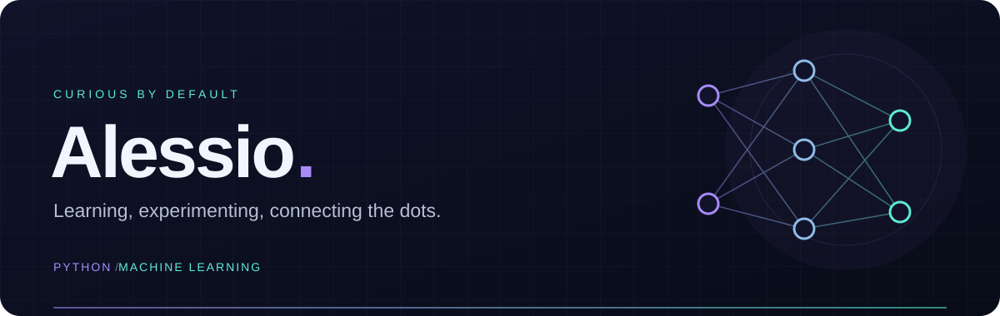
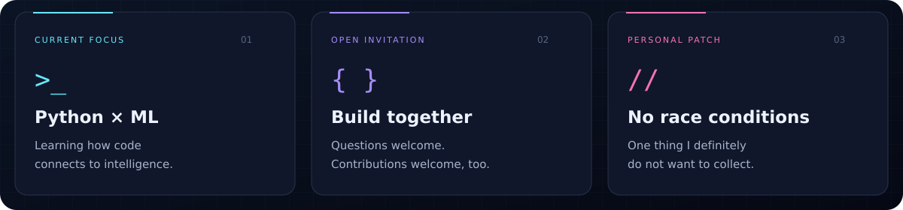
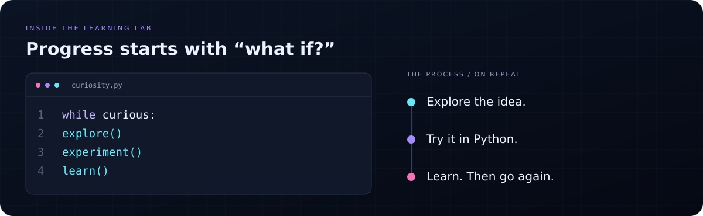
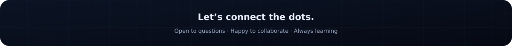

  

  
  &nbsp;
  

## Hey, I'm Alessio 👋

I'm learning **machine learning with Python** — following my curiosity, trying things out, and sharing the journey here. Have a question or want to contribute to one of my projects? You're welcome to jump in.

  

  

  

